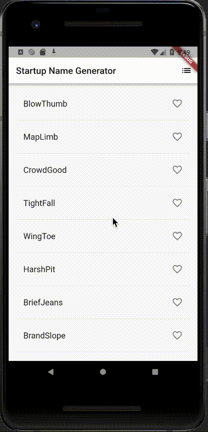
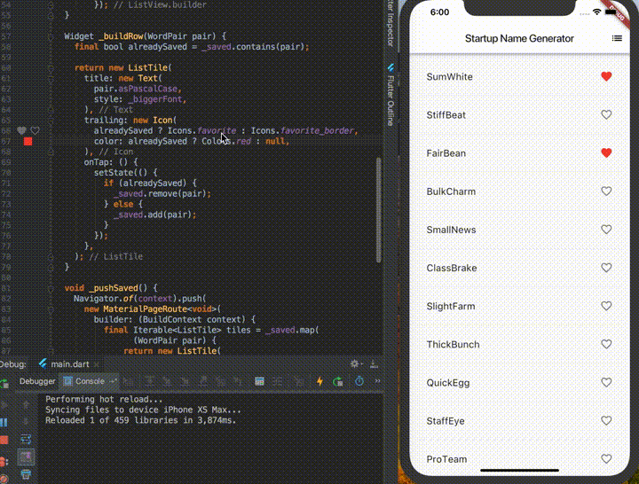

### 2018.11 オフサイトミーティング
　  
　  
　  
　  
T.Saihara
---
### はじめに
---
このスライドは  
GitPitch というサービスを使っています

Note:

これはMarkdownでメモってたら資料におとすのがめんどくさかったので
GitHubに置いたMarkdownからスライドショーを作ってくれる、GitPitch
というサービスを使っています。

+++  

---
自己紹介

Note:

ほぼはじめましての方が6,7割かと思いますので、軽く自己紹介させてください。
---
- 名前 : Saihara
- 役割 : エンジニア(Java,Javascript,Node\.js/Web(Frontend), Swift,Objective-C/iOS, Java/Android ほか)
  
  
<div align="left">
@size[0.7em](相原さんのご紹介により   2018.04よりお世話になっております)
</div>

Note:

名前は、と申します。  
役割としては、エンジニアとしてやらせて頂いており、
WebであればJavaやJavascript,Node.jsなど、iOSやAndroidのスマホアプリをネイティブで、  
その他.Net系C#,VB.Netなど色々やります。  
  
  
相原さんにご紹介頂いて、今年の4月からパートナーとしてお世話になっております。
---
### CrossPlatform Moble App

Note:

今回は、私が気になっているスマホアプリのClossPlatform開発環境をご紹介します。
---
@transition[none]

@snap[north]
Agenda
@snapend
  
@snap[west]
- CrossPlatformの種類(前置き)  
- 紹介ソリューション  
  - 特徴  
  - HelloWorld  
  - それぞれの見た目と動作  
  - 私的な推しPOINT  
  - まとめ・感想  
@snapend

Note:

Agendaはこんな形で、進めていきます。  
---
### CrossPlatformの種類
---
#### Web
- Webアプリ |
- PWA |
- AMP |

Note:

まずは、ブラウザから利用できるWebアプリ。レスポンシブにしておけば、PC用と同じ資産を使えますね。  

PWAは、Webページをモバイル端末で開いた時、ネイティブアプリの様な挙動を提供できるものです。  
iOSも11.3から対応したようですね。  

AMP(Accelerated Mobile Pages)は、Webページを高速化するものでアプリとは少し括りが違いますが、
WebアプリやPWAの動作に寄与するものとして挙げます。
---
#### ハイブリッドアプリ
- React Native |
- Xamarin |
- Cordova |
- And more... |

Note:

OSネイティブで動作するもの、ハイブリッドアプリともいいます。　　

ReactNative Javascriptを使うものです。  
Xamarinは、Microsoft主導で、C#を使います。  
Cordova これはもともとPhoneGapと言われていたものですね。これもJavascriptです。Webviewベースなので、上記2つとは若干UI/UXが変わる感じになります。
その他にも、ゲームであれば Unity であるとか、Cocos2d-xなどありますが、  
今回目をつけましたのは、...
---


@snap[south]
@size[0.1em](“Flutter identity assets” by The Chromium Authors is licensed under <a href='http://creativecommons.org/licenses/by-sa/4.0/'>CC BY 4.0</a>)
@snapend

Note:

Flutter というものです。

---
### どんな特徴？
---
@transition[none]

- Google製  
- オープンソース |
- Dart 言語 |
- Android, iOS Fuchcia |
- 独自UI |

Note:

Google製の  
オープンソースなフレームワーク,SDKです。  
Dartという言語で開発します。前述のXamarinやReactNativeと違い、独自言語なので若干学習コストが高いかもしれません。  
対応プラットフォームは、iOS,Androidは勿論のこと、の次期OSとも噂されるFuchciaにも対応してます。  

---
### Hello world
```java
class MyApp extends StatelessWidget {
  @override
  Widget build(BuildContext context) {
    return MaterialApp(
      title: 'Welcome to Flutter',
      home: Scaffold(
        appBar: AppBar(
          title: Text('Welcome to Flutter'),
        ),
        body: Center(
          child: Text('Hello World'),
        ),
      ),
    );
  }
}
```

@snap[east]

@snapend
  
Note:

完全に抜粋ですが、こんな感じになります。  

---
### 見た目と動作

Note:

実際の見た目はどうでしょう。
---
#### Android


Note:

Androidはこんな感じです。一般的なAndroidアプリらしいと思います。
---
#### iOS


Note:

iOSです。これも一般的なiOSアプリらしい見た目と思います。

---
#### 並べるとこんな感じ
@div[left-50]

@divend

@div[right-50]

@divend

Note:

並べると、機能的には同じですがそれぞれ各OSっぽい感じになっている事が見えます。　　
例えば、画面遷移後、左上 戻るアローの形は違いますね。
後、スクロールエンドまで引っ張った時のエフェクトも、iOSではバウンスしてますがAndroidでは波が出ます。  
画像では分かりづらいですが、画面戻る操作で、iOSではスワイプで戻れますがAndroidでは戻れません。  
これは画面遷移に戻るキーを使う前提だからですね。
---
#### コード
```java
  Widget build(BuildContext context) {
    return new Scaffold(
      appBar: new AppBar(
        title: const Text('Startup Name Generator'),
        actions: <Widget>[
          new IconButton(icon: const Icon(Icons.list), onPressed: _pushSaved),
        ],
      ),
      body: _buildSuggestions(),
    );
  }

  Widget _buildSuggestions() {
    return new ListView.builder(
        padding: const EdgeInsets.all(16.0),
        itemBuilder: (BuildContext _context, int i) {
          if (i.isOdd) {
            return const Divider();
          }
          final int index = i ~/ 2;
          if (index >= _suggestions.length) {
            _suggestions.addAll(generateWordPairs().take(10));
          }
          return _buildRow(_suggestions[index]);
        });
  }
```
---
### 私的な推しPOINT  

Note:

---
@transition[none]

IDE(Android Studio,IntelliJ,VSCode)  
  
Hot reload  

Note:

IDEのプラグインがいい感じでした。AndroidStudioで使ってみましたが、
(当たり前ですが)Androidアプリ開発と同じように作業可能で、iOSシミュレーターへのアタッチも
違和感なく行けました。

---
### Hot reload  


Note:

HotReloadを実際にやってみた感じです。  
リストアイテムの右側に配置されているアイコンを変更して、色を変えるくらいの簡単なものですが、
保存後数秒も待たずシミュレーターの方に反映されています。  
コード書きながら、画面配置確認しながらがかなりラクラクできそうです。
---
### まとめ・感想
---

---
#### Flutter  
Official  
https://flutter.io/  
Tutorial  
https://flutter.io/tutorials/
---
### Fin
