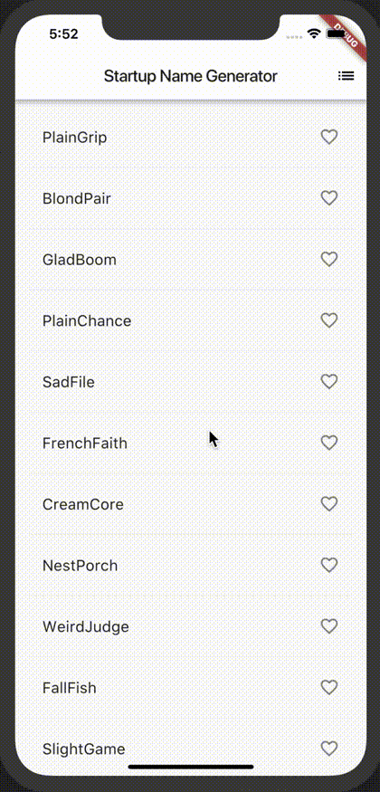

### 2018.11 testtest
　  
　  
　  
　  
T.Saihara
---
このスライドは  
GitPitch というサービスを使っています

Note:

これはMarkdownでメモってたら資料におとすのがめんどくさかったので
GitHubに置いたMarkdownからスライドショーを作ってくれる、GitPitch
というサービスを使っています。
---
自己紹介

Note:

ほぼはじめましての方が6,7割かと思いますので、軽く自己紹介させてください。
---
- 名前 : XXXX
- 役割 : エンジニア(Web, Frontend, Swift,Objective-C/iOS, Java/Android ほか)


相原さんのご紹介により 2018.04よりお世話になっております

Note:

名前は、XXXXXと申します。  
役割としては、エンジニアとしてやらせて頂いており、
WebであればJavaやJavascript,Node.jsなど、iOSやAndroidのスマホアプリをネイティブで、  
その他.Net系C#,VB.Netなど色々やります。  
相原さんにご紹介頂いて、今年の4月からパートナーとしてお世話になっております。
---
仕事とか
---
ここは  
　  
### 強調表示  

でなにか指定します  
　  
Count ・・
---
CrossPlatform Moble App

Note:

今回は、私が気になっているスマホアプリのClossPlatform開発環境をご紹介します。
---
### CrossPlatformの種類？
---
### Web
- Webアプリ |
- PWA |
- AMP |

Note:

まずは、ブラウザから利用できるWebアプリ。レスポンシブにしておけば、PC用と同じ資産を使えますね。  

PWAは、Webページをモバイル端末で開いた時、ネイティブアプリの様な挙動を提供できるものです。  
iOSも11.3から対応したようですね。  

AMP(Accelerated Mobile Pages)は、Webページを高速化するものでアプリとは少し括りが違いますが、
WebアプリやPWAの動作に寄与するものとして挙げます。
---
### ハイブリッドアプリ
- React Native |
- Xamarin |
- Cordova |
- And more... |

Note:

今回目をつけましたのは、And more に当たる...
---

## Flutter

Note:

Flutter というものです。

---
### どんな特徴？
- Google製 |
- オープンソース |
- Dart 言語 |
- Android, iOS Fuchcia |
- 独自UI |

Note:

Google製の  
オープンソースなフレームワーク,SDKです。  
Dartという言語で開発します。前述のXamarinやReactNativeと違い、独自言語なので若干学習コストが高いかもしれません。  
対応プラットフォームは、iOS,Androidは勿論のこと、の次期OSとも噂されるFuchciaにも対応してます。  

---
### 見た目と動作

Note:

サンプル
---
@div[left-50]
<br>

@divend

@div[right-50]
<br>

@divend
---
### 私的な推しPOINT  
IDE(Android Studio,IntelliJ,VSCode)  
Hot reload  

Note:

IDEのプラグインがいい感じでした。AndroidStudioで使ってみましたが、
(当たり前ですが)Androidアプリ開発と同じように作業可能で、iOSシミュレーターへのアタッチも
違和感なく行けました。
---
### Hot reload  

---
### Hello world
```java
class MyApp extends StatelessWidget {
  @override
  Widget build(BuildContext context) {
    return MaterialApp(
      title: 'Welcome to Flutter',
      home: Scaffold(
        appBar: AppBar(
          title: Text('Welcome to Flutter'),
        ),
        body: Center(
          child: Text('Hello World'),
        ),
      ),
    );
  }
}
```
---
Official  
https://flutter.io/  
Tutorial  
https://flutter.io/tutorials/
---
Fin
